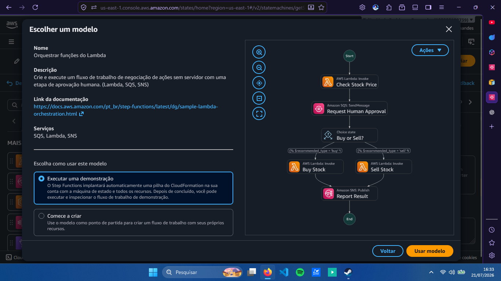
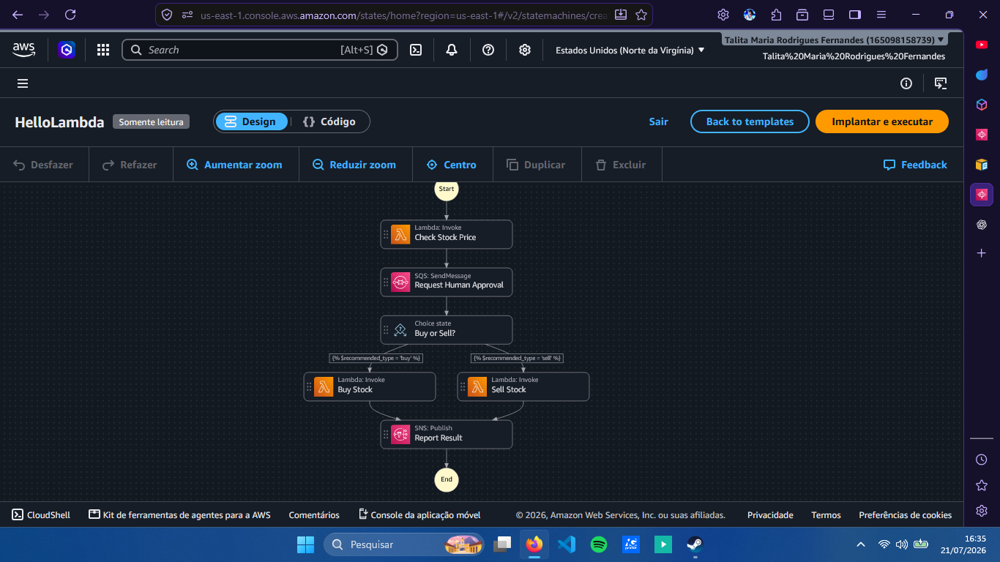
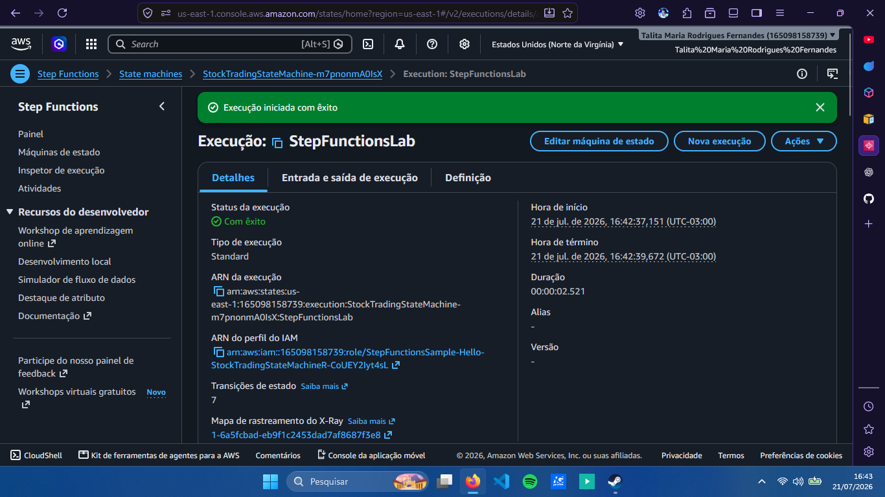
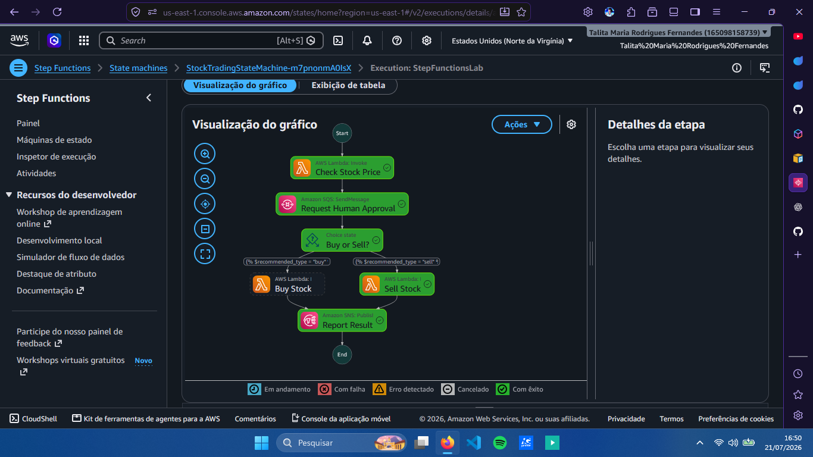

# aws-step-functions-lab
Laboratório prático utilizando AWS Step Functions para orquestração de workflows automatizados integrando AWS Lambda, Amazon SQS e Amazon SNS.

# 🚀 Explorando Workflows Automatizados com AWS Step Functions

## 📖 Sobre o projeto

Este repositório foi desenvolvido como parte do laboratório da DIO com o objetivo de explorar o serviço **AWS Step Functions**, responsável pela orquestração de workflows automatizados utilizando diferentes serviços da AWS.

Durante a prática, foi possível compreender como criar uma máquina de estados (State Machine), integrar funções AWS Lambda, utilizar serviços de mensageria e executar fluxos automatizados de forma visual.

---

## 🎯 Objetivos

- Compreender o funcionamento do AWS Step Functions;
- Criar e implantar uma State Machine;
- Executar um workflow automatizado;
- Integrar diferentes serviços da AWS;
- Documentar a experiência prática.

---

## 🛠️ Serviços utilizados

- AWS Step Functions
- AWS Lambda
- Amazon SQS
- Amazon SNS

---

## 🔄 Workflow desenvolvido

O fluxo criado realiza as seguintes etapas:

1. Inicia a execução da máquina de estados;
2. Consulta informações utilizando uma função AWS Lambda;
3. Envia uma solicitação de aprovação através do Amazon SQS;
4. Avalia a decisão utilizando um estado de escolha (Choice);
5. Executa a função correspondente para compra ou venda;
6. Publica o resultado utilizando o Amazon SNS;
7. Finaliza a execução do workflow.

---

## 📷 Evidências da prática

### Escolha do modelo

### Estrutura do workflow

### Execução realizada

### Visualização gráfica da execução

---

## 💡 Aprendizados

Durante este laboratório foi possível compreender como o AWS Step Functions facilita a criação de workflows automatizados através da integração entre diversos serviços da AWS.

A visualização gráfica das execuções tornou o acompanhamento do fluxo muito mais intuitivo, permitindo identificar cada etapa executada e entender como os serviços trabalham em conjunto.

---

## ✅ Conclusão

O AWS Step Functions demonstrou ser uma ferramenta eficiente para orquestrar processos distribuídos, proporcionando uma maneira organizada, escalável e de fácil manutenção para integrar diferentes serviços da AWS.

Este laboratório contribuiu para consolidar os conceitos de automação de workflows e integração entre serviços em ambientes de computação em nuvem.

---
**Talita Maria Rodrigues Fernandes**

Desenvolvido durante o Boot
